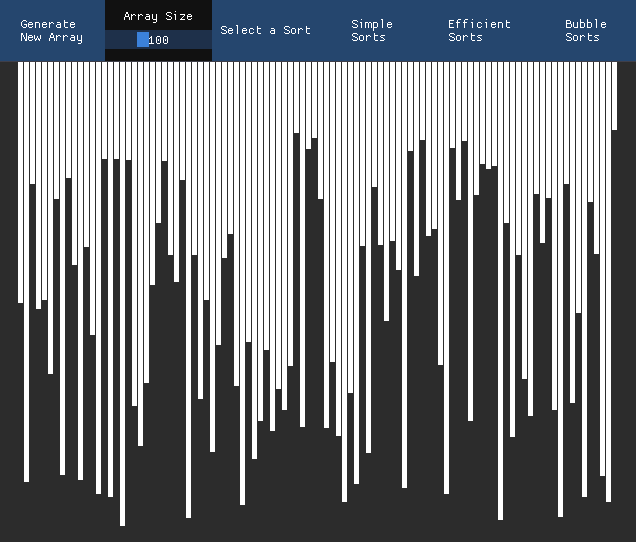
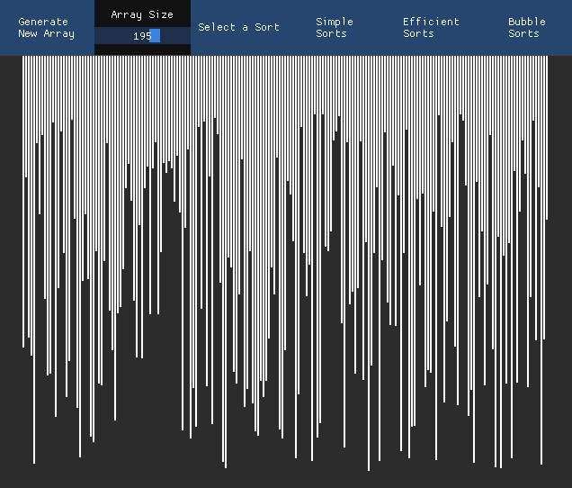

# Sorting Visualizer
Written in C++, using SDL2 and IMGui.

A user interface to allow for visualization of various sorting algorithms.
This project is not yet complete, I intend to add more sorting algorithms
and add other features.

#### Current Algorithms included:
Bubble, Insertion, Selection, Merge, Quick, Counting, and Radix Sort.

## Generate Arrays and Resize Array 
You can create different sized arrays and generate new ones at that size.

## Sort
The sorting algorithms are separated in to three different drop down menus.

